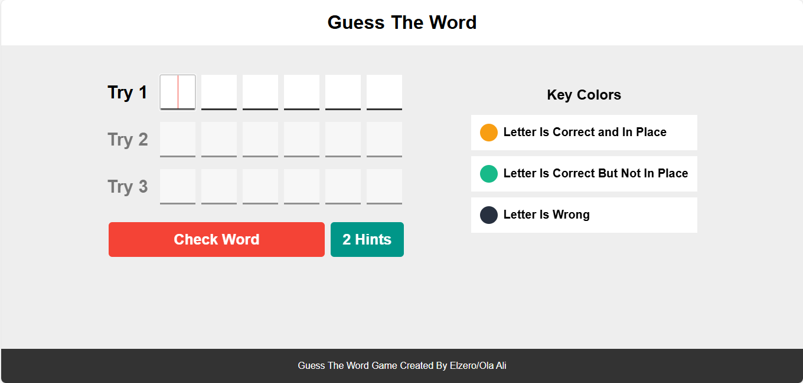

# Guess-The-Word-Game

A fun and interactive game where players try to guess a hidden word within a limited number of tries. This project is built using HTML, CSS, and JavaScript.

## Table of contents

- [Overview](#overview)
  - [Usage](#Usage)
  - [Links](#links)
  - [Screenshot](#Screenshot)
- [My process](#my-process)
  - [Features](#Features)
  - [What I learned](#what-i-learned)
  - [Continued development](#continued-development)
- [Author](#author)
- [Acknowledgments](#Acknowledgments)

## overview

The "Guess The Word Game" is designed to challenge players to guess a hidden word within a limited number of attempts. The game provides hints and visual feedback to guide players towards the correct word. It's a great way to test your vocabulary and problem-solving skills.

## Usage

1. Open index.html in your web browser to start the game.
2. Enter your guesses in the input fields and click “Check Word” to see if you guessed correctly.
3. Use the “Hints” button if you need help.

### Links

If you want to open the link in a new tab, you can:

- Press **Ctrl** (or **Cmd** on Mac) while clicking the link.
- Right-click the link and select **Open link in new tab**.

Otherwise, all links will open in the same tab.

- Solution URL: [here](https://github.com/olahasan/Guess-The-Word-Game)

- Live Site URL: [here]()

## Screenshot

## my-process

## Features

- Multiple attempts to guess the word
- Hints to assist players
- Visual feedback for correct and incorrect guesses
- Audio feedback for win and lose scenarios

## what-i-learned

Through this project, I learned how to:

- Dynamically create and manage HTML elements using JavaScript
- Implement event listeners for user interactions
- Use CSS for styling and layout
- Provide visual and audio feedback based on user actions

## Continued Development

In future iterations of this project, I plan to:

- Add more words to the guessing pool
- Implement a scoring system
- Enhance the UI/UX with animations and transitions
- Add difficulty levels to challenge players further

### Author

GitHub - @olahasan

### Acknowledgments

I would like to thank the **[Elzero Web School](https://elzero.org/)** for providing this challenge and to the community for their support.
